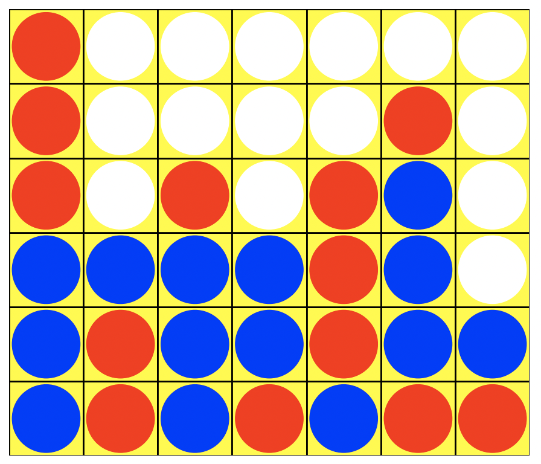

# Connect4-MCTS
Connect 4 Game Simulator with Monte Carlo Tree Search AI

Connect4-MCTS is an advanced Connect 4 simulator that integrates the Monte Carlo Tree Search (MCTS) algorithm for strategic gameplay. While the game maintains the simplicity of the classic Connect 4, the AI player, powered by MCTS, introduces a challenging and insightful dimension to the game. This project serves as a practical demonstration of MCTS's capabilities in game strategy and decision-making.




## Dependencies
This project is implemented in Python and requires the following libraries:
- [Python 3](https://www.python.org/downloads)
- [NumPy](https://numpy.org/)
- [Matplotlib](https://matplotlib.org/) (for game state visualization)

## Running the Simulator
To play against the AI or simulate AI vs AI games, run:
```python
        python connect4_play.py
```
For a demonstration of the AI in action, you can also check out:
```python
        python connect4_demo.py
```
These scripts showcase the implementation of MCTS in Connect 4 and allow for customizable game settings.

Features
MCTS AI: An AI player that uses the MCTS algorithm, capable of making strategic decisions based on the current state of the game.
Human vs AI Mode: Play against the MCTS AI to test your Connect 4 strategies.
AI vs AI Mode: Watch two AI players compete against each other, useful for analyzing the effectiveness of MCTS in different scenarios.
Customisable Game Settings: Easily adjust game parameters to explore different aspects of gameplay.
Visualisation: Graphical representation of the game board, providing a clear and interactive way to follow the game.
Contributing
Contributions to enhance the functionality, improve the AI algorithm, or streamline the user experience are welcome. Feel free to fork the repository, make changes, and submit pull requests.
